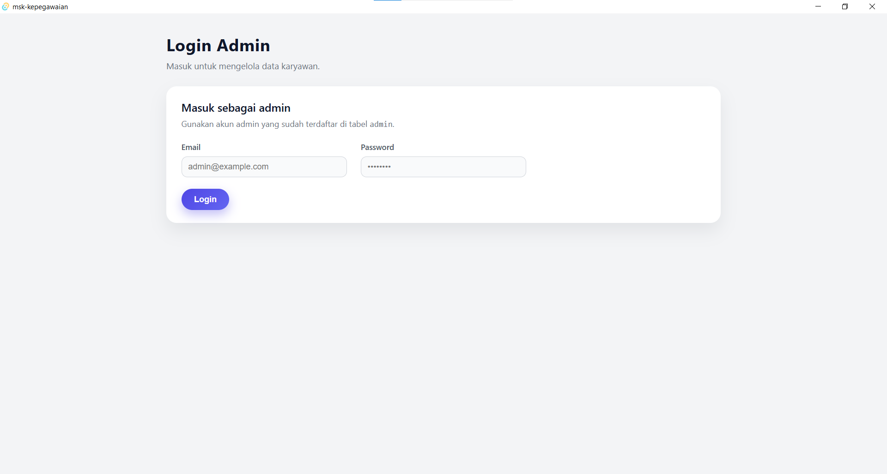
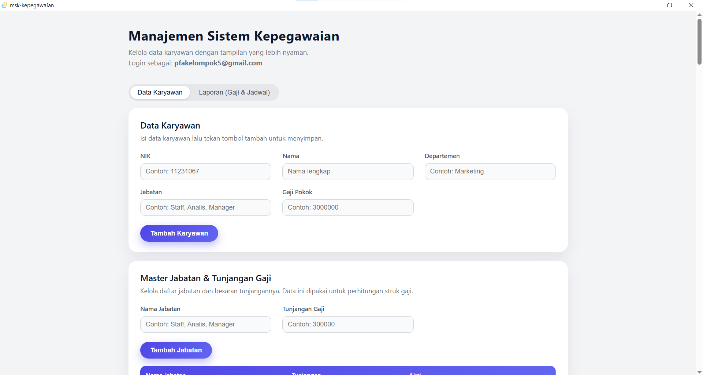
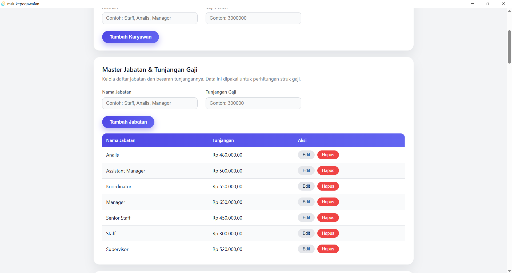
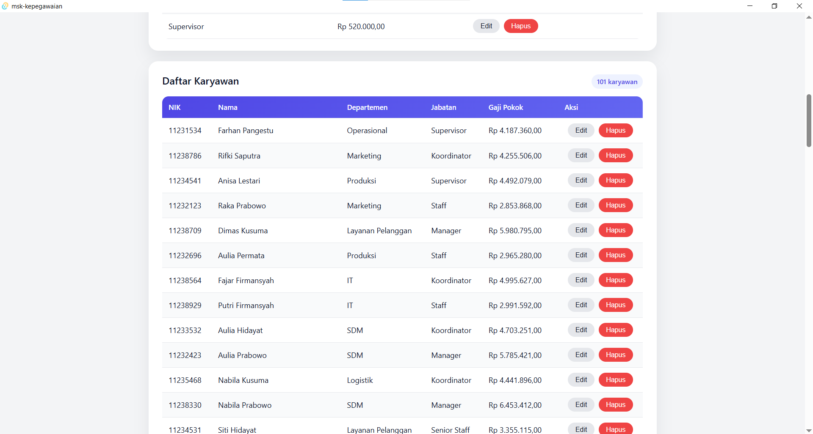
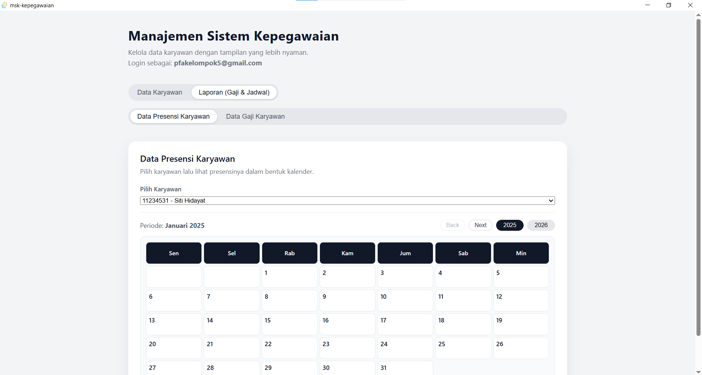
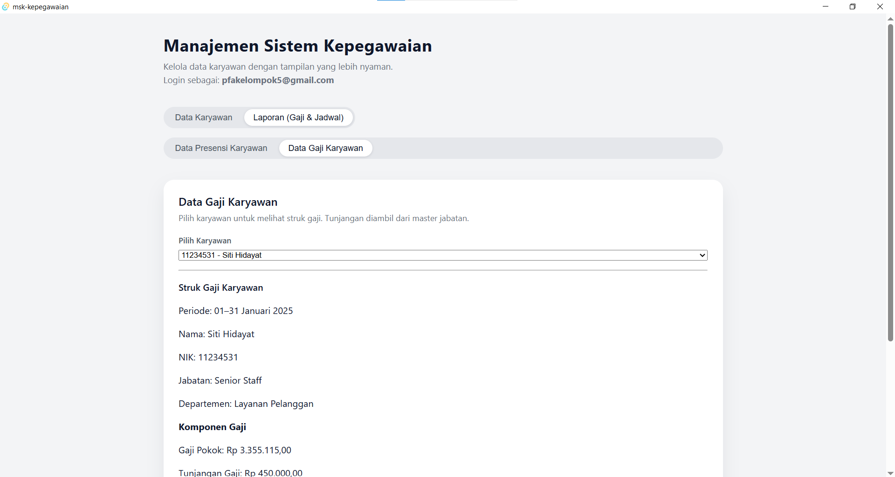

# Manajemen Sistem Kepegawaian K5
_A Functional Programming Approach with Rust_  
**Authors:** Bagas Yoga Pratama Pramudika, Michael Peter Valentino Situmeang, Muhammad Zaki Afriza, Rafi Baydar Athaillah

---

## Abstract

This project aims to build a desktop-based employee management system using Rust and the Tauri framework. The application focuses on managing employee master data (NIK, nama, departemen, jabatan, gaji pokok) serta presensi melalui integrasi dengan layanan backend (misalnya Supabase) dan komponen kalender di sisi frontend. Rust is chosen because of its strong guarantees on memory safety and performance, which are important for reliable desktop applications. Functional programming principles are applied through the use of immutable data structures, pure functions for business rules (seperti perhitungan gaji dan filter data karyawan), and composition with iterators and higher-order functions. The current progress already covers basic CRUD for employees and integration between the Tauri backend and the React frontend. Future work includes enriching attendance features, reporting, and improving the UX to make the system suitable for small to medium-sized organizations.

---

## Introduction

Pengelolaan data kepegawaian di banyak organisasi kecil masih dilakukan secara manual, misalnya dengan spreadsheet atau catatan terpisah. Hal ini menyulitkan ketika jumlah karyawan bertambah, karena:

- Data mudah tidak sinkron (antara presensi, gaji, dan data karyawan).
- Pencarian dan rekap membutuhkan waktu lama.
- Rentan terhadap kesalahan input dan penghitungan.

Project ini mencoba menyelesaikan masalah tersebut dengan sebuah aplikasi **Manajemen Sistem Kepegawaian** yang terintegrasi:

- Menyimpan data karyawan secara terstruktur.
- Mengelola presensi (hadir/tidak hadir) melalui tampilan kalender.
- Menjadi dasar untuk fitur penggajian dan laporan.

**Mengapa Rust?**

- Menawarkan **keamanan memori** yang kuat tanpa garbage collector.
- Performa tinggi dan cocok untuk aplikasi desktop jangka panjang.
- Ekosistem yang mulai matang untuk GUI melalui **Tauri**.

**Mengapa memasukkan konsep Functional Programming?**

- Mempermudah reasoning terhadap logika bisnis karena fungsi dibuat **pure** (output hanya ditentukan oleh input).
- Mendorong **immutability** sehingga bug terkait shared state bisa dikurangi.
- Memanfaatkan **iterators dan higher-order functions** (seperti `map`, `filter`) untuk memproses list data karyawan dan presensi dengan cara yang deklaratif.

**Keunikan solusi:**

- Menggabungkan Rust + Tauri + React dengan backend Supabase untuk menyimpan data presensi.
- Mencoba menerapkan pola functional di dalam codebase Rust (domain & service layer).
- Ditujukan sebagai aplikasi desktop ringan yang tetap bisa memanfaatkan layanan cloud.

---

## Background and Concepts

### Technology Stack

- **Rust**  
  Digunakan sebagai bahasa utama di sisi backend Tauri. Rust mengelola:
  - Definisi domain `Employee` dan `NewEmployee`.
  - Layer service untuk operasi bisnis (list, tambah karyawan, dsb.).
  - Command Tauri seperti `cmd_list_employees` dan `cmd_add_employee`.

- **Tauri**  
  Framework untuk membuat aplikasi desktop berbasis web. Tauri menghubungkan:
  - Frontend (React) dengan backend Rust melalui `#[tauri::command]`.
  - Integrasi sistem (window, menu, dll.) dengan footprint yang ringan.

- **Frontend (React + TypeScript/JavaScript)**  
  - Menyediakan form input karyawan (NIK, nama, departemen, jabatan, gaji pokok).
  - Menampilkan tabel daftar karyawan.
  - Berkomunikasi dengan backend Rust menggunakan `@tauri-apps/api` (misalnya `invoke("cmd_add_employee", { newEmp: ... })`).

- **Backend Database**  
  - Menyimpan tabel `employees` dengan kolom `nik`, `name`, `department`, `position`, `base_salary`, dan `inserted_at`.
  - Menyimpan data presensi yang terhubung ke karyawan dan kalender.

- **Async Runtime: Tokio**  
  - Menangani operasi asynchronous, seperti akses database atau HTTP call.
  - Memungkinkan Tauri command untuk menunggu operasi IO tanpa mem-block thread.

- **Supporting Crates**  
  - `serde` – serialisasi/deserialisasi struct Rust ke/ dari JSON.
  - `serde_json` – bekerja dengan JSON di boundary frontend–backend.
  - `thiserror` / `anyhow` – mempermudah penanganan dan pelaporan error.
  - `tokio` – runtime asynchronous.

### Functional Programming Concepts

Beberapa konsep functional programming yang menjadi panduan desain:

- **Immutability**  
  - Variabel menggunakan `let` sebisa mungkin tanpa `mut`.
  - Data karyawan diproses dengan membuat salinan baru (misal `map`/`filter`) daripada memodifikasi in-place.

- **Pure Functions**  
  - Fungsi bisnis seperti perhitungan total gaji atau filter karyawan aktif dibuat tanpa side effect:
    - Tidak membaca/menulis ke global state.
    - Hanya menerima parameter dan mengembalikan nilai.

- **Higher-Order Functions & Iterators**  
  - Penggunaan method seperti `.iter()`, `.map()`, `.filter()`, `.fold()` di koleksi karyawan dan presensi.
  - Mengurangi penggunaan loop imperatif dan index manual.

- **Pattern Matching**  
  - `match` pada `Result<T, E>` untuk menangani keberhasilan/gagalnya operasi database atau I/O.
  - Menghindari banyak `if-else` dan membuat alur error handling lebih jelas.

---

## Source Code and Explanation

### Arsitektur Proyek

- **Domain Layer (`employee.rs`, dll.)**

```rust
pub struct Employee {
    pub id: i64,
    pub nik: String,
    pub name: String,
    pub department: String,
    pub position: String,
    pub base_salary: i64,
}

pub struct NewEmployee {
    pub nik: String,
    pub name: String,
    pub department: String,
    pub position: String,
    pub base_salary: i64,
}
```

- **Service Layer (`employee_service.rs`)**

```rust
pub fn list_employees() -> Result<Vec<Employee>, String> {
    // Mengambil data dari database / Supabase dan memetakan ke Vec<Employee>
    // (Detail implementasi disesuaikan dengan proyek)
}

pub fn add_employee(new_emp: NewEmployee) -> Result<(), String> {
    // Validasi + insert data ke storage
}
```

- **Tauri Commands (`commands.rs`)**

```rust
use crate::app::services::employee_service;
use crate::app::domain::employee::{Employee, NewEmployee};

#[tauri::command]
pub fn cmd_list_employees() -> Result<Vec<Employee>, String> {
    employee_service::list_employees()
}

#[tauri::command]
pub fn cmd_add_employee(new_emp: NewEmployee) -> Result<(), String> {
    employee_service::add_employee(new_emp)
}
```

- **Frontend React (`App.jsx`)**

- Menyimpan state form:

```jsx
const [form, setForm] = useState({
    nik: "",
    name: "",
    department: "",
    position: "",
    base_salary: "",
});
```

- Memanggil backend dengan gaya deklaratif:

```jsx
const handleSubmit = async (e) => {
    e.preventDefault();
    try {
    await invoke("cmd_add_employee", {
        newEmp: {
        nik: form.nik,
        name: form.name,
        department: form.department,
        position: form.position,
        base_salary: parseInt(form.base_salary || "0", 10),
        },
    });

    setForm({
        nik: "",
        name: "",
        department: "",
        position: "",
        base_salary: "",
    });
    await loadEmployees();
    } catch (err) {
    console.error("Error add employee:", err);
    alert("Gagal menambah karyawan");
    }
};
```

## Screenshot

- **Halaman Login**



- **Tampilan Tab Data Karyawan**







- **Tampilan Tab Laporan Gaji dan Jadwal**



