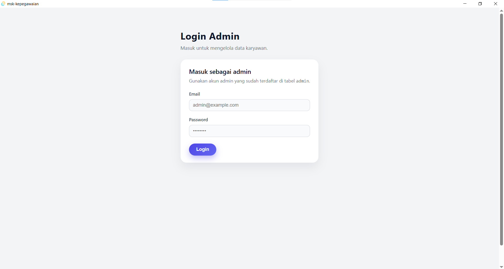
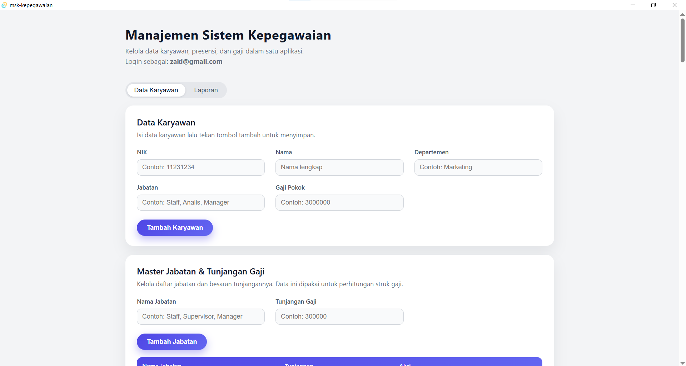
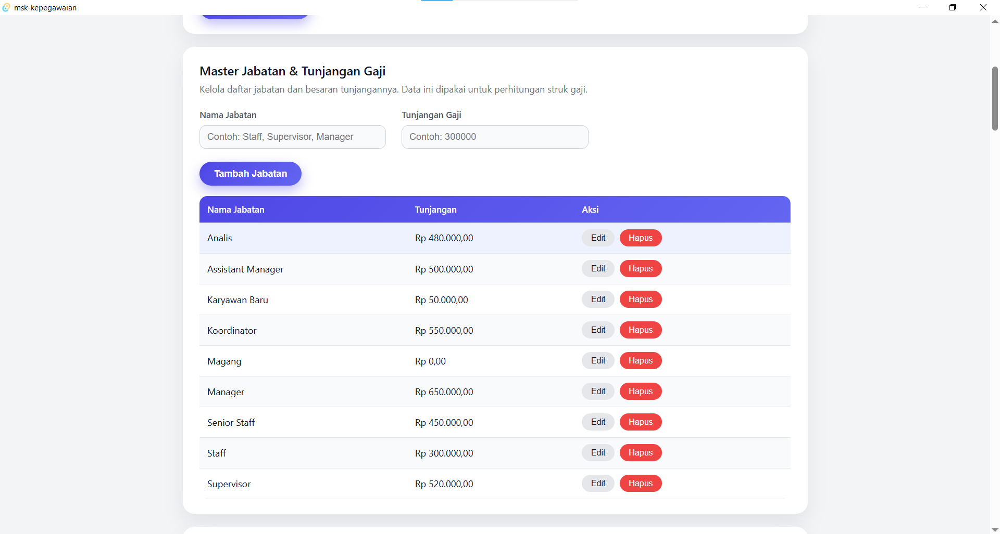
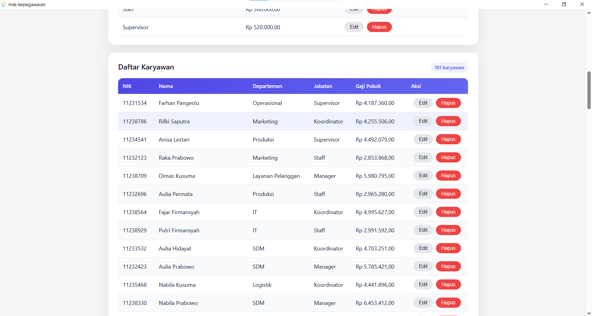
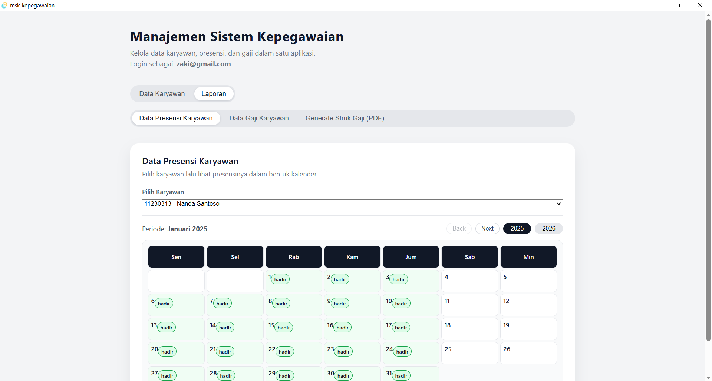
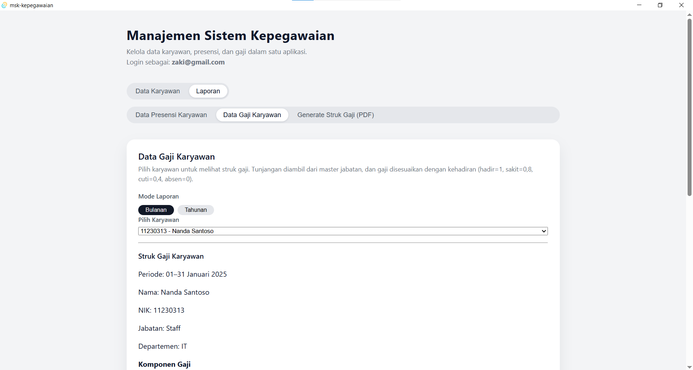
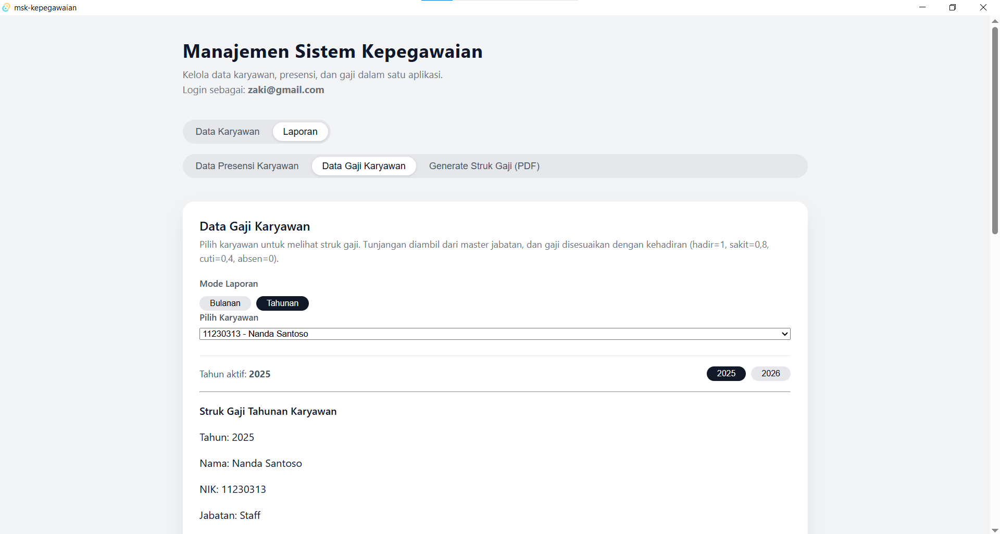
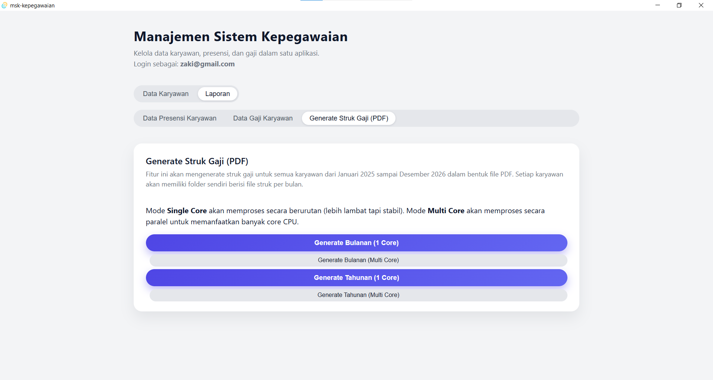

# Manajemen Sistem Kepegawaian K5
_A Functional Programming Approach with Rust_  
**Authors:** Bagas Yoga Pratama Pramudika, Michael Peter Valentino Situmeang, Muhammad Zaki Afriza, Rafi Baydar Athaillah

---

## Abstract

Proyek ini bertujuan untuk mengembangkan Sistem Manajemen Karyawan menggunakan Bahasa Pemrograman Rust dan Framework Tauri. Sistem ini dirancang untuk menangani operasi CRUD (Create, Read, Update, Delete) terkait data karyawan, jabatan, serta pencatatan presensi harian. Backend aplikasi dibangun menggunakan Rust untuk memanfaatkan keamanan memori dan performa tingginya, sementara antarmuka pengguna berbasis desktop menggunakan Tauri. Penyimpanan data ditangani secara eksternal menggunakan Supabase melalui komunikasi REST API.

---

## Introduction

Pengelolaan data kepegawaian di banyak organisasi kecil masih dilakukan secara manual, misalnya dengan spreadsheet atau catatan terpisah. Hal ini menyulitkan ketika jumlah karyawan bertambah, karena:

- Data mudah tidak sinkron (antara presensi, gaji, dan data karyawan).
- Pencarian dan rekap membutuhkan waktu lama.
- Rentan terhadap kesalahan input dan penghitungan.

Project ini mencoba menyelesaikan masalah tersebut dengan sebuah aplikasi Manajemen Sistem Kepegawaian yang terintegrasi:

- Menyimpan data karyawan secara terstruktur.
- Mengelola presensi (hadir/tidak hadir) melalui tampilan kalender.
- Menjadi dasar untuk fitur penggajian dan laporan.

**Mengapa Rust?**

Rust digunakan pada proyek ini karena jaminan keamanan memori (memory safety) tanpa memerlukan garbage collector. Hal ini memastikan aplikasi berjalan dengan performa yang dapat diprediksi. Selain itu, sistem tipe data Rust yang kuat membantu mencegah runtime errors sejak tahap kompilasi.

**Mengapa memasukkan konsep Functional Programming?**

- Mempermudah reasoning terhadap logika bisnis karena fungsi dibuat pure (output hanya ditentukan oleh input).
- Mendorong immutability sehingga bug terkait shared state bisa dikurangi.
- Memanfaatkan iterators dan higher-order functions seperti `map`, `filter` untuk memproses list data karyawan dan presensi dengan cara yang deklaratif.

**Keunikan solusi:**

Aplikasi kami menggabungkan kecepatan Rust di belakang layar dengan tampilan modern yang ringan. Kami juga tidak perlu menginstall database ribet di komputer, karena semua data tersimpan aman di cloud (Supabase).

---

## Background and Concepts

### Technology Stack

- **Rust**
  Bahasa pemrograman sistem yang digunakan untuk menangani seluruh logika backend aplikasi. Rust dipilih karena kemampuannya mengelola memori secara aman tanpa Garbage Collector, menjamin performa tinggi dan stabilitas aplikasi.

- **Tauri**
  Framework untuk membangun aplikasi desktop yang sangat ringan. Tauri bekerja dengan memanfaatkan WebView bawaan sistem operasi untuk merender tampilan, sementara logika intinya dijalankan langsung oleh Rust. Pendekatan ini memungkinkan pembuatan aplikasi yang aman, sangat efisien dalam penggunaan memori, dan memiliki ukuran installer yang kecil.

- **Supabase**
  Platform Backend-as-a-Service (BaaS) yang menyediakan database PostgreSQL secara cloud. Dalam proyek ini, Supabase bertindak sebagai pusat penyimpanan data yang diakses melalui protokol REST API, sehingga kita tidak perlu mengelola server database lokal.

- **Tokio**
  Runtime asinkron (Asynchronous Runtime) untuk Rust. Tokio bertugas menangani operasi berat seperti permintaan jaringan (network request) di latar belakang (background thread), sehingga antarmuka aplikasi tidak macet (freeze) saat menunggu balasan dari server.

- **Reqwest**
  HTTP Client untuk Rust yang mudah digunakan. Library ini berfungsi untuk melakukan panggilan API (GET, POST, PATCH, DELETE) ke server Supabase, mengirimkan data input pengguna, dan menerima respon dari server.

- **Serde**
  Framework untuk memproses data JSON. Serde bertugas menerjemahkan objek data Rust (Struct) menjadi format JSON agar bisa dikirim ke API, dan sebaliknya menerjemahkan respon JSON dari API menjadi objek Rust yang bisa diolah oleh program.

### Functional Programming Concepts

Beberapa konsep functional programming yang menjadi panduan desain:

- **Immutability**  
  - Variabel menggunakan `let` sebisa mungkin tanpa `mut`.
  - Data karyawan diproses dengan membuat salinan baru (misal `map`/`filter`) daripada memodifikasi in-place.

- **Pure Functions**  
  - Fungsi bisnis seperti perhitungan total gaji atau filter karyawan aktif dibuat tanpa side effect:
    - Tidak membaca/menulis ke global state.
    - Hanya menerima parameter dan mengembalikan nilai.

- **Higher-Order Functions & Iterators**  
  - Penggunaan method seperti `.iter()`, `.map()`, `.filter()`, `.fold()` di koleksi karyawan dan presensi.
  - Mengurangi penggunaan loop imperatif dan index manual.

- **Pattern Matching**  
  - `match` pada `Result<T, E>` untuk menangani keberhasilan/gagalnya operasi database atau I/O.
  - Menghindari banyak `if-else` dan membuat alur error handling lebih jelas.

---

## Source Code and Explanation

### Main dan Konfigurasi

1.  **main.rs**

```rust
#![cfg_attr(not(debug_assertions), windows_subsystem = "windows")]

mod app;
mod commands;

fn main() {
    tauri::Builder::default()
        .invoke_handler(tauri::generate_handler![
            commands::cmd_list_employees,
            commands::cmd_add_employee,
            commands::cmd_admin_login,
            commands::cmd_update_employee,
            commands::cmd_delete_employee,
            commands::cmd_list_jabatan,
            commands::cmd_add_jabatan,
            commands::cmd_update_jabatan,
            commands::cmd_delete_jabatan,
            commands::cmd_list_presensi,
            commands::cmd_get_presensi_summary,
            commands::cmd_upsert_presensi,
            commands::cmd_generate_slip_batch,
            commands::cmd_generate_slip_yearly_batch,

        ])
        .run(tauri::generate_context!())
        .expect("error running tauri application");
}
```

Penjelasan:
- Baris pertama mengonfigurasi atribut `windows_subsystem` agar console window tidak muncul saat aplikasi dijalankan dalam mode rilis di Windows.
- Modul `app` dan `commands` dimuat untuk menghubungkan struktur folder aplikasi.
- Pada fungsi `main`, aplikasi Tauri dibangun menggunakan pola builder. Fungsi `.invoke_handler(tauri::generate_handler![...])` digunakan untuk mendaftarkan fungsi-fungsi Rust agar dapat dipanggil dari frontend JavaScript.
- Daftar handler mencakup seluruh fungsi logika aplikasi, mulai dari manajemen data karyawan, jabatan, presensi, hingga perintah khusus untuk pembuatan laporan gaji (`cmd_generate_slip_batch` dan `cmd_generate_slip_yearly_batch`).
- Terakhir, `.run(tauri::generate_context!())` menjalankan event loop aplikasi, membaca konfigurasi dari `tauri.conf.json`, dan menjaga aplikasi tetap berjalan.

2.  **lib.rs**

```rust
#[tauri::command]
fn greet(name: &str) -> String {
    format!("Hello, {}! You've been greeted from Rust!", name)
}

#[cfg_attr(mobile, tauri::mobile_entry_point)]
pub fn run() {
    tauri::Builder::default()
        .plugin(tauri_plugin_opener::init())
        .invoke_handler(tauri::generate_handler![greet])
        .run(tauri::generate_context!())
        .expect("error while running tauri application");
}
```

Penjelasan:
- Baris pertama menggunakan atribut #[tauri::command] untuk menandai bahwa fungsi di bawahnya bisa dipanggil dari frontend melalui invoke() pada sisi JavaScript Tauri.
- Baris kedua hingga keempat mendefinisikan fungsi greet, menerima parameter nama berupa &str, dan mengembalikan string yang dibentuk menggunakan format! — fungsi ini nantinya akan diekspor sebagai command ke frontend.
- Pada atribut baris keenam, #[cfg_attr(mobile, tauri::mobile_entry_point)] memastikan fungsi run akan menjadi entry point aplikasi jika dibangun untuk perangkat mobile, sedangkan pada desktop atribut ini diabaikan.
- Di fungsi run, aplikasi Tauri dibangun dengan pola builder: tauri::Builder::default() membuat instance dasar, kemudian .plugin(...) menambahkan plugin pembuka file/URL, dan .invoke_handler(tauri::generate_handler![greet]) mendaftarkan fungsi greet sebagai command yang dapat dipanggil dari frontend.
- Makro tauri::generate_handler! menerima daftar fungsi command dan menghasilkan handler internal Tauri agar dapat berkomunikasi dengan frontend.
- .run(tauri::generate_context!()) akan membaca konfigurasi dari tauri.conf.json, lalu menjalankan event loop Tauri untuk membuka jendela aplikasi dan menangani event maupun command sampai aplikasi ditutup.
- .expect("error while running tauri application") digunakan sebagai error handling yang menampilkan pesan jika aplikasi gagal dijalankan.

3. **commands.rs**

```rust
use crate::app::domain::employee::{Employee, NewEmployee};
use crate::app::domain::admin::Admin;
use crate::app::domain::jabatan::{Jabatan, NewJabatan};
use crate::app::domain::presensi::{Presensi, NewPresensi};
use crate::app::domain::presensi_summary::PresensiSummary;
use crate::app::services::{
    employee_service,
    admin_service,
    jabatan_service,
    presensi_service,
    payslip_pdf_service,
};

#[tauri::command]
pub async fn cmd_list_employees() -> Result<Vec<Employee>, String> {
    employee_service::list_employees().await
}

#[tauri::command]
pub async fn cmd_add_employee(new_emp: NewEmployee) -> Result<(), String> {
    employee_service::add_employee(new_emp).await
}

#[tauri::command]
pub async fn cmd_admin_login(email: String, password: String) -> Result<Admin, String> {
    admin_service::login_admin(email, password).await
}

#[tauri::command]
pub async fn cmd_update_employee(employee: Employee) -> Result<(), String> {
    employee_service::update_employee(employee).await
}

#[tauri::command]
pub async fn cmd_delete_employee(id: i64) -> Result<(), String> {
    employee_service::delete_employee(id).await
}

#[tauri::command]
pub async fn cmd_list_jabatan() -> Result<Vec<Jabatan>, String> {
    jabatan_service::list_jabatan().await
}

#[tauri::command]
pub async fn cmd_add_jabatan(jabatan: NewJabatan) -> Result<(), String> {
    jabatan_service::add_jabatan(jabatan).await
}

#[tauri::command]
pub async fn cmd_update_jabatan(nama: String, jabatan: NewJabatan) -> Result<(), String> {
    jabatan_service::update_jabatan(nama, jabatan).await
}

#[tauri::command]
pub async fn cmd_delete_jabatan(nama: String) -> Result<(), String> {
    jabatan_service::delete_jabatan(nama).await
}

#[tauri::command]
pub async fn cmd_list_presensi(
    employee_id: i64,
    year: i32,
    month: i32,
) -> Result<Vec<Presensi>, String> {
    presensi_service::list_presensi_for_employee_month(employee_id, year, month).await
}

#[tauri::command]
pub async fn cmd_get_presensi_summary(
    employee_id: i64,
    year: i32,
    month: i32,
) -> Result<PresensiSummary, String> {
    presensi_service::get_presensi_summary_for_employee_month(employee_id, year, month).await
}

#[tauri::command]
pub async fn cmd_upsert_presensi(presensi: NewPresensi) -> Result<(), String> {
    presensi_service::upsert_presensi(presensi).await
}

#[tauri::command]
pub async fn cmd_generate_slip_batch(mode: String) -> Result<(), String> {
    use crate::app::services::payslip_pdf_service::GenerateMode;

    let mode = match mode.as_str() {
        "single" => GenerateMode::SingleCore,
        "multi"  => GenerateMode::MultiCore,
        other    => return Err(format!("Mode generate tidak dikenal: {}", other)),
    };

    let output_root = "./struk_gaji_output";

    payslip_pdf_service::generate_slips_jan_2025_to_dec_2026(output_root, mode).await
}

#[tauri::command]
pub async fn cmd_generate_slip_yearly_batch(mode: String) -> Result<(), String> {
    use crate::app::services::payslip_pdf_service::GenerateMode;

    let mode = match mode.as_str() {
        "single" => GenerateMode::SingleCore,
        "multi"  => GenerateMode::MultiCore,
        other    => return Err(format!("Mode generate tidak dikenal: {}", other)),
    };

    let output_root = "./struk_gaji_output_tahunan";

    payslip_pdf_service::generate_yearly_slips_2025_2026(output_root, mode).await
}
```

Penjelasan:
- File ini berfungsi sebagai gerbang penghubung (interface) antara Frontend Tauri dan Backend Rust.
- Mengimpor berbagai modul service (`employee_service`, `presensi_service`, `payslip_pdf_service`) yang berisi logika bisnis utama.
- Setiap fungsi diberi atribut `#[tauri::command]` dan bersifat `async` agar proses berat tidak membekukan antarmuka aplikasi.
- Fungsi-fungsi seperti `cmd_generate_slip_batch` menerima parameter `mode` ("single" atau "multi") untuk menentukan apakah proses pembuatan PDF dilakukan secara berurutan atau secara paralel menggunakan multi-core processing.

4. **src/app/mod.rs**

```rust
pub mod domain;
pub mod infra;
pub mod services;
```

Penjelasan:
- Baris-baris ini mendeklarasikan tiga modul utama dalam folder app yaitu `domain`, `infra`, dan `services`, sehingga dapat digunakan oleh seluruh bagian aplikasi.
- `pub mod domain;` membuka akses ke modul domain yang berisi definisi struktur data inti/entitas seperti `Employee`, `Admin`, `Jabatan`, dan `Presensi`.
- `pub mod infra;` membuka akses ke modul infra (infrastruktur) yang biasanya berisi implementasi koneksi database, repository, atau komunikasi dengan sistem eksternal.
- `pub mod services;` membuka akses ke modul services yang mengatur logika bisnis, menjadi penghubung antara command (Tauri backend) dan layer database/infrastruktur.

5. **build.rs**

```rust
fn main() {
    tauri_build::build()
}
```

Penjelasan:
- Fungsi `main` pada file `build.rs` akan dijalankan sebelum proses kompilasi utama, karena `build.rs` adalah build script di Rust.
- Pada baris di dalam fungsi, `tauri_build::build()` dipanggil untuk melakukan persiapan build aplikasi Tauri, seperti:
  - memproses file konfigurasi `tauri.conf.json`.
  - menghasilkan aset atau kode tambahan yang diperlukan saat compile
  - menyesuaikan konfigurasi build sesuai platform (Windows, Linux, macOS, atau mobile)
- Build script ini memastikan bahwa hasil build sudah sesuai kebutuhan runtime Tauri sebelum aplikasi dikompilasi dan dijalankan.

### Domain

6. **admin.rs**

```rust
use serde::{Deserialize, Serialize};

#[derive(Debug, Clone, Serialize, Deserialize)]
pub struct Admin {
    pub email: String,
}
```

Penjelasan:
- Baris `use serde::{Deserialize, Serialize};` mengimpor trait yang memungkinkan struct di-serialize dan di-deserialize (misalnya untuk komunikasi frontend–backend lewat JSON).
- Atribut `#[derive(Debug, Clone, Serialize, Deserialize)]` otomatis memberikan kemampuan:
  - Debug → bisa dicetak untuk keperluan debugging
  - Clone → bisa digandakan nilainya
  - Serialize & Deserialize → data dapat dikirim/diterima melalui Tauri command dan database dengan format JSON
- pub struct Admin adalah model domain untuk Admin yang memiliki satu field publik `email: String`, sehingga bisa diakses di seluruh aplikasi.

7. **employee.rs**

```rust
use serde::{Deserialize, Serialize};

macro_rules! define_employee_types {
    ($($common:tt)*) => {
        #[derive(Debug, Clone, Serialize, Deserialize)]
        pub struct Employee {
            pub id: i64,
            $($common)*
        }

        #[derive(Debug, Clone, Serialize, Deserialize)]
        pub struct NewEmployee {
            $($common)*
        }
    };
}

define_employee_types! {
    pub nik: String,
    pub name: String,
    pub department: String,
    pub position: String,
    pub base_salary: i64,
}
```

Penjelasan:
- Menggunakan `serde` untuk serialisasi data JSON.
- Macro `define_employee_types!`: Kode ini menggunakan fitur Rust Macros (`macro_rules!`) untuk mendefinisikan struct `Employee` (dengan ID) dan `NewEmployee` (tanpa ID) sekaligus.
- Pendekatan ini menerapkan prinsip DRY (Don't Repeat Yourself), sehingga kita tidak perlu menulis ulang field (nik, name, dst) dua kali. Ini mengurangi risiko ketidakkonsistenan tipe data antara saat insert dan saat read.

8. **jabatan.rs**

```rust
use serde::{Deserialize, Serialize};

#[derive(Debug, Clone, Serialize, Deserialize)]
pub struct Jabatan {
    pub nama: String,
    pub tunjangan: f64,
}

pub type NewJabatan = Jabatan;
```

Penjelasan:
- Mengimpor Serialize dan Deserialize agar struct dapat dikirim/diterima dalam format JSON saat berkomunikasi dengan frontend.
- Debug dan Clone otomatis diimplementasikan untuk memudahkan debugging dan penggandaan data.
- `Jabatan` merepresentasikan data jabatan yang sudah ada di sistem, memiliki field nama dan tunjangan.
- `NewJabatan` digunakan saat menambahkan data jabatan baru, memiliki field yang sama namun tanpa identitas tambahan dari database.

9. **presensi.rs**

```rust
use serde::{Deserialize, Serialize};

macro_rules! define_presensi_types {
    ($($common:tt)*) => {
        #[derive(Debug, Clone, Serialize, Deserialize)]
        pub struct Presensi {
            pub id: i64,
            $($common)*
        }

        #[derive(Debug, Clone, Serialize, Deserialize)]
        pub struct NewPresensi {
            $($common)*
        }
    };
}

define_presensi_types! {
    pub employee_id: i64,
    pub tanggal: String,
    pub status: String,
}
```

Penjelasan:
- Serialize dan Deserialize dari serde memungkinkan data presensi dikonversi ke/dari JSON untuk komunikasi dengan frontend.
- Debug dan Clone memudahkan debugging serta penggandaan objek data.
- `Presensi` merepresentasikan data presensi yang sudah tersimpan di sistem, sehingga memiliki id serta employee_id, tanggal, dan status.
- `NewPresensi` digunakan saat menambahkan atau memperbarui data presensi dan tidak memiliki id karena nilai tersebut biasanya dihasilkan oleh database.

10. **presensi_summary.rs**
```rust
use serde::{Deserialize, Serialize};

#[derive(Debug, Clone, Serialize, Deserialize)]
pub struct PresensiSummary {
    pub total_hadir: i64,
    pub total_sakit: i64,
    pub total_cuti: i64,
    pub total_absen: i64,
}
```

Penjelasan:
- Struct `PresensiSummary` berfungsi sebagai objek transfer data (DTO) sederhana.
- Struct ini digunakan untuk menampung hasil rekapitulasi perhitungan kehadiran, yang berisi jumlah total hari untuk setiap kategori status: `total_hadir`, `total_sakit`, `total_cuti`, dan `total_absen`.

11. **src/app/domain/mod.rs**

```rust
pub mod employee;
pub mod admin;
pub mod jabatan;
pub mod presensi;
pub mod presensi_summary;
```

Penjelasan:
- File ini mendeklarasikan modul `domain` yang ada dalam folder domain, sehingga dapat digunakan oleh bagian lain aplikasi.
- `pub mod employee;`, `pub mod admin;`, `pub mod jabatan;`, dan `pub mod presensi;` masing-masing membuka akses ke definisi entitas bisnis utama aplikasi, yaitu data pegawai, admin, jabatan, dan presensi.
- Dengan deklarasi ini, seluruh model domain dapat di-import dari luar modul domain menggunakan `crate::app::domain::....`

### Infrastructure

11. **supabase.rs**

```rust
use dotenvy::dotenv;
use reqwest::Client;
use serde::de::DeserializeOwned;
use serde::Serialize;
use std::env;

pub struct Supabase {
    base_url: String,
    pub anon_key: String,
    http: Client,
}

impl Supabase {
    pub fn new() -> Self {
        dotenv().ok();

        let project_url =
            env::var("SUPABASE_URL").expect("SUPABASE_URL not set");
        let anon_key =
            env::var("SUPABASE_ANON_KEY").expect("SUPABASE_ANON_KEY not set");

        let rest_url = format!("{}/rest/v1", project_url.trim_end_matches('/'));

        let http = Client::new();

        Self {
            base_url: rest_url,
            anon_key,
            http,
        }
    }

    fn endpoint(&self, path: &str) -> String {
        format!("{}/{}", self.base_url.trim_end_matches('/'), path)
    }

    async fn send_request(
        &self,
        req: reqwest::RequestBuilder,
        err_prefix: &str,
    ) -> Result<String, String> {
        let res = req.send().await.map_err(|e| e.to_string())?;
        let status = res.status();
        let text = res.text().await.unwrap_or_default();

        if !status.is_success() {
            Err(format!("{err_prefix} {status}: {text}"))
        } else {
            Ok(text)
        }
    }

    pub async fn get_json<T: DeserializeOwned>(
        &self,
        path: &str,
        err_prefix: &str,
    ) -> Result<T, String> {
        let url = self.endpoint(path);

        let text = self
            .send_request(
                self.http
                    .get(url)
                    .header("apikey", &self.anon_key)
                    .header("Authorization", format!("Bearer {}", self.anon_key)),
                err_prefix,
            )
            .await?;

        serde_json::from_str::<T>(&text).map_err(|e| {
            format!("{err_prefix} parse error: {e} | body: {text}")
        })
    }

    pub async fn insert_json<B: Serialize>(
        &self,
        path: &str,
        body: &B,
        err_prefix: &str,
    ) -> Result<(), String> {
        let url = self.endpoint(path);

        let _ = self
            .send_request(
                self.http
                    .post(url)
                    .header("apikey", &self.anon_key)
                    .header("Authorization", format!("Bearer {}", self.anon_key))
                    .json(body),
                err_prefix,
            )
            .await?;

        Ok(())
    }

    pub async fn patch_json<B: Serialize>(
        &self,
        path: &str,
        body: &B,
        err_prefix: &str,
    ) -> Result<(), String> {
        let url = self.endpoint(path);

        let _ = self
            .send_request(
                self.http
                    .patch(url)
                    .header("apikey", &self.anon_key)
                    .header("Authorization", format!("Bearer {}", self.anon_key))
                    .json(body),
                err_prefix,
            )
            .await?;

        Ok(())
    }

    pub async fn upsert_json<B: Serialize>(
        &self,
        path: &str,
        body: &B,
        err_prefix: &str,
    ) -> Result<(), String> {
        let url = self.endpoint(path);

        let _ = self
            .send_request(
                self.http
                    .post(url)
                    .header("apikey", &self.anon_key)
                    .header("Authorization", format!("Bearer {}", self.anon_key))
                    .header("Content-Type", "application/json")
                    .header("Prefer", "resolution=merge-duplicates")
                    .json(body),
                err_prefix,
            )
            .await?;

        Ok(())
    }

    pub async fn delete(
        &self,
        path: &str,
        err_prefix: &str,
    ) -> Result<(), String> {
        let url = self.endpoint(path);

        let _ = self
            .send_request(
                self.http
                    .delete(url)
                    .header("apikey", &self.anon_key)
                    .header("Authorization", format!("Bearer {}", self.anon_key)),
                err_prefix,
            )
            .await?;

        Ok(())
    }
}
```

Penjelasan:
- File ini mengatur seluruh komunikasi jaringan ke database Supabase secara terpusat.
- Struct `Supabase` mengimplementasikan Metode Generik (`Generic Methods`) untuk menangani berbagai tipe data secara dinamis:
    - `get_json<T>`: Mengambil data dari API dan mem-parsing respon JSON langsung ke dalam struct Rust apa pun (T).
    - `insert_json<B>`, `patch_json<B>`, `upsert_json<B>`: Mengirim data ke server untuk operasi penambahan atau pembaruan data dengan tipe struct input (B).
- Header otentikasi seperti `apikey` dan `Authorization` diatur secara otomatis di dalam fungsi privat `send_request`, sehingga lapisan service tidak perlu menangani detail keamanan koneksi.

12. **src/app/infra/mod.rs**

```rust
pub mod supabase;
```

Penjelasan:
- Baris ini mendeklarasikan bahwa modul supabase merupakan bagian dari modul infra, sehingga dapat diakses dari bagian lain aplikasi melalui path seperti `crate::app::infra::supabase`.
- Modul `infra` sendiri berfungsi sebagai layer infrastruktur, sehingga deklarasi ini menunjukkan bahwa koneksi dan komunikasi dengan Supabase berada di lapisan ini.

### Services

13. **admin_service.rs**

```rust
use crate::app::domain::admin::Admin;
use crate::app::infra::supabase::Supabase;

pub async fn login_admin(email: String, password: String) -> Result<Admin, String> {
    let sb = Supabase::new();

    let query = format!(
        "admin?select=email&email=eq.{email}&password=eq.{password}&limit=1"
    );

    let admins: Vec<Admin> = sb
        .get_json(&query, "Supabase login error")
        .await?;

    admins
        .into_iter()
        .next()
        .ok_or_else(|| "Email atau password salah".to_string())
}
```

Penjelasan:
- Fungsi `login_admin` menangani otentikasi administrator.
- Menggunakan struct `Supabase` untuk membuat koneksi.
- Logika otentikasi dilakukan dengan mengirim query ke tabel `admin` yang memfilter berdasarkan `email` dan `password` yang cocok, serta membatasi hasil pencarian (`limit=1`).
- Menggunakan metode generik `.get_json()` untuk mengambil data. Jika data ditemukan, fungsi mengembalikan objek `Admin`; jika array kosong (tidak ada yang cocok), fungsi mengembalikan pesan error "Email atau password salah".

14. **employee_service.rs**

```rust
use crate::app::domain::employee::{Employee, NewEmployee};
use crate::app::infra::supabase::Supabase;

pub async fn list_employees() -> Result<Vec<Employee>, String> {
    let sb = Supabase::new();

    sb.get_json::<Vec<Employee>>(
        "employee?select=*&order=id.asc",
        "Supabase list employees error",
    )
    .await
}

pub async fn add_employee(new_emp: NewEmployee) -> Result<(), String> {
    let sb = Supabase::new();

    sb.insert_json(
        "employee",
        &new_emp,
        "Supabase insert employee error",
    )
    .await
}

pub async fn update_employee(emp: Employee) -> Result<(), String> {
    let sb = Supabase::new();
    let path = format!("employee?id=eq.{}", emp.id);
    let payload = NewEmployee {
        nik: emp.nik,
        name: emp.name,
        department: emp.department,
        position: emp.position,
        base_salary: emp.base_salary,
    };

    sb.patch_json(
        &path,
        &payload,
        "Supabase update employee error",
    )
    .await
}

pub async fn delete_employee(id: i64) -> Result<(), String> {
    let sb = Supabase::new();

    let path = format!("employee?id=eq.{id}");

    sb.delete(
        &path,
        "Supabase delete employee error",
    )
    .await
}
```

Penjelasan:
- Menangani operasi CRUD (Create, Read, Update, Delete) untuk data karyawan.
- List: Fungsi `list_employees` mengambil seluruh data pegawai yang diurutkan berdasarkan ID menggunakan `sb.get_json::<Vec<Employee>>`.
- Add: Fungsi `add_employee` menggunakan `sb.insert_json` untuk mengirim data pegawai baru (`NewEmployee`) ke database.
- Update: Fungsi `update_employee` menyusun payload data baru dan mengirimkannya menggunakan `sb.patch_json` dengan filter ID karyawan di URL.
- Delete: Fungsi `delete_employee` menghapus data karyawan berdasarkan ID menggunakan `sb.delete`.
- Kode di sini sangat ringkas karena seluruh detail penanganan HTTP request dan header sudah diabstraksi di dalam modul infrastruktur.

15. **jabatan_service.rs**

```rust
use crate::app::domain::jabatan::{Jabatan, NewJabatan};
use crate::app::infra::supabase::Supabase;
use urlencoding::encode;

pub async fn list_jabatan() -> Result<Vec<Jabatan>, String> {
    let sb = Supabase::new();

    sb.get_json::<Vec<Jabatan>>(
        "jabatan?select=*&order=nama.asc",
        "Supabase list jabatan error",
    )
    .await
}

pub async fn add_jabatan(jabatan: NewJabatan) -> Result<(), String> {
    let sb = Supabase::new();

    sb.insert_json(
        "jabatan",
        &jabatan,
        "Supabase insert jabatan error",
    )
    .await
}

pub async fn update_jabatan(nama: String, jabatan: NewJabatan) -> Result<(), String> {
    let sb = Supabase::new();

    let path = format!("jabatan?nama=eq.{}", encode(&nama));

    sb.patch_json(
        &path,
        &jabatan,
        "Supabase update jabatan error",
    )
    .await
}

pub async fn delete_jabatan(nama: String) -> Result<(), String> {
    let sb = Supabase::new();

    let path = format!("jabatan?nama=eq.{}", encode(&nama));

    sb.delete(
        &path,
        "Supabase delete jabatan error",
    )
    .await
}
```

Penjelasan:
- Menangani manajemen data jabatan dan besaran tunjangannya.
- Mirip dengan service karyawan, namun memiliki perbedaan pada cara identifikasi data. Karena jabatan tidak menggunakan ID angka melainkan nama jabatan sebagai primary key, parameter URL memerlukan penanganan khusus.
- URL Encoding: Fungsi `update_jabatan` dan `delete_jabatan` menggunakan `urlencoding::encode` pada nama jabatan. Hal ini penting untuk memastikan bahwa karakter spasi atau simbol khusus pada nama jabatan (misalnya "Staff IT") dapat dibaca dengan benar oleh URL browser/API (menjadi "Staff%20IT").

16. **presensi_service.rs**

```rust
use crate::app::domain::presensi::{Presensi, NewPresensi};
use crate::app::domain::presensi_summary::PresensiSummary;
use crate::app::infra::supabase::Supabase;
use chrono::NaiveDate;

pub async fn list_presensi_for_employee_month(
    employee_id: i64,
    year: i32,
    month: i32,
) -> Result<Vec<Presensi>, String> {
    let sb = Supabase::new();

    let first = NaiveDate::from_ymd_opt(year, month as u32, 1)
        .ok_or_else(|| "Tanggal awal tidak valid".to_string())?;
    let last = if month == 12 {
        NaiveDate::from_ymd_opt(year + 1, 1, 1)
            .ok_or_else(|| "Tanggal akhir tidak valid".to_string())?
            .pred_opt()
            .ok_or_else(|| "Tanggal akhir tidak valid".to_string())?
    } else {
        NaiveDate::from_ymd_opt(year, (month + 1) as u32, 1)
            .ok_or_else(|| "Tanggal akhir tidak valid".to_string())?
            .pred_opt()
            .ok_or_else(|| "Tanggal akhir tidak valid".to_string())?
    };

    let start_date = first.format("%Y-%m-%d").to_string();
    let end_date = last.format("%Y-%m-%d").to_string();

    let query = format!(
        "presensi?select=*&employee_id=eq.{employee_id}\
        &tanggal=gte.{start_date}&tanggal=lte.{end_date}&order=tanggal.asc"
    );

    sb.get_json::<Vec<Presensi>>(
        &query,
        "Supabase list presensi error",
    )
    .await
}

pub async fn get_presensi_summary_for_employee_month(
    employee_id: i64,
    year: i32,
    month: i32,
) -> Result<PresensiSummary, String> {
    let items = list_presensi_for_employee_month(employee_id, year, month).await?;

    let mut summary = PresensiSummary {
        total_hadir: 0,
        total_sakit: 0,
        total_cuti: 0,
        total_absen: 0,
    };

    for p in items {
        match p.status.as_str() {
            "hadir" => summary.total_hadir += 1,
            "sakit" => summary.total_sakit += 1,
            "cuti"  => summary.total_cuti  += 1,
            "absen" => summary.total_absen += 1,
            other => {
                eprintln!("[get_presensi_summary] status tak dikenal: {}", other);
            }
        }
    }

    Ok(summary)
}

pub async fn upsert_presensi(presensi: NewPresensi) -> Result<(), String> {
    let sb = Supabase::new();

    let path = "presensi?on_conflict=employee_id,tanggal";

    sb.upsert_json(
        path,
        &presensi,
        "Supabase upsert presensi error",
    )
    .await
}
```

Penjelasan:
- Manipulasi Tanggal: Fungsi `list_presensi_for_employee_month` menggunakan library `chrono` untuk menghitung tanggal awal (tanggal 1) dan tanggal akhir bulan secara otomatis berdasarkan input tahun dan bulan. Rentang tanggal ini digunakan untuk memfilter data presensi.
- Upsert: Fungsi `upsert_presensi` menggunakan metode `sb.upsert_json`. Teknik upsert (Update or Insert) memastikan bahwa jika data presensi untuk karyawan dan tanggal tersebut sudah ada, data lama akan diperbarui; jika belum ada, data baru akan dibuat. Ini mencegah duplikasi data presensi harian.
- Logika Agregasi: Fungsi `get_presensi_summary_for_employee_month` tidak hanya mengambil data, tetapi juga melakukan pemrosesan data. Fungsi ini melakukan iterasi (looping) pada daftar presensi yang diambil dari database untuk menghitung jumlah total hari `hadir`, `sakit`, `cuti`, dan `absen`, lalu mengemasnya ke dalam objek `PresensiSummary`.

17. **payslip_pdf_service.rs**

```rust
use crate::app::domain::employee::Employee;
use crate::app::domain::jabatan::Jabatan;
use crate::app::domain::presensi_summary::PresensiSummary;
use crate::app::services::{employee_service, jabatan_service, presensi_service};

use chrono::{Datelike, Duration, NaiveDate};
use genpdf::Element;
use std::fs;
use std::path::{Path, PathBuf};
use std::sync::Arc;
use tokio::sync::Semaphore;
use once_cell::sync::Lazy;

static SUPABASE_SEMAPHORE: Lazy<Semaphore> = Lazy::new(|| Semaphore::new(12));

pub enum GenerateMode {
    SingleCore,
    MultiCore,
}

pub async fn generate_slips_jan_2025_to_dec_2026(
    root_dir: &str,
    mode: GenerateMode,
) -> Result<(), String> {
    let employees = employee_service::list_employees().await?;
    let jabatans_vec = jabatan_service::list_jabatan().await?;
    let jabatans = Arc::new(jabatans_vec);

    let periods: Vec<(i32, u32)> = (2025..=2026)
        .flat_map(|year| (1..=12).map(move |month| (year, month)))
        .collect();

    fs::create_dir_all(root_dir).map_err(|e| e.to_string())?;

    match mode {
        GenerateMode::SingleCore => {
            for emp in employees {
                generate_slips_for_employee(emp, &jabatans, &periods, root_dir).await?;
            }
        }
        GenerateMode::MultiCore => {
            use tokio::task;

            let mut handles = Vec::new();

            for emp in employees {
                let jabatans = Arc::clone(&jabatans);
                let periods = periods.clone();
                let root = root_dir.to_string();
                let emp_name = emp.name.clone();

                let handle = task::spawn(async move {
                    if let Err(e) =
                        generate_slips_for_employee(emp, &jabatans, &periods, &root).await
                    {
                        eprintln!("[generate_slips_multi] {}: {}", emp_name, e);
                    }
                });

                handles.push(handle);
            }

            for handle in handles {
                let _ = handle.await;
            }
        }
    }

    Ok(())
}

pub async fn generate_yearly_slips_2025_2026(
    root_dir: &str,
    mode: GenerateMode,
) -> Result<(), String> {
    let employees = employee_service::list_employees()
        .await
        .map_err(|e| format!("gagal load karyawan: {e}"))?;

    let jabatans = Arc::new(
        jabatan_service::list_jabatan()
            .await
            .map_err(|e| format!("gagal load jabatan: {e}"))?,
    );

    let years = vec![2025, 2026];

    fs::create_dir_all(root_dir)
        .map_err(|e| format!("gagal membuat folder root slip tahunan: {e}"))?;

    match mode {
        GenerateMode::SingleCore => {
            for emp in employees {
                generate_yearly_slips_for_employee(
                    emp,
                    &years,
                    Arc::clone(&jabatans),
                    root_dir,
                )
                .await?;
            }
        }
        GenerateMode::MultiCore => {
            let mut handles = Vec::new();

            for emp in employees {
                let jabatans_clone = Arc::clone(&jabatans);
                let years_clone = years.clone();
                let root_clone = root_dir.to_string();

                let handle = tokio::spawn(async move {
                    if let Err(e) = generate_yearly_slips_for_employee(
                        emp,
                        &years_clone,
                        jabatans_clone,
                        &root_clone,
                    )
                    .await
                    {
                        eprintln!("gagal generate slip tahunan: {e}");
                    }
                });

                handles.push(handle);
            }

            for h in handles {
                if let Err(e) = h.await {
                    eprintln!("task join error: {e}");
                }
            }
        }
    }

    Ok(())
}

async fn generate_slips_for_employee(
    emp: Employee,
    jabatans: &Arc<Vec<Jabatan>>,
    periods: &[(i32, u32)],
    root_dir: &str,
) -> Result<(), String> {
    let emp_dir = build_employee_dir(root_dir, &emp);
    fs::create_dir_all(&emp_dir).map_err(|e| e.to_string())?;

    for (year, month) in periods {
        let summary: PresensiSummary =
            get_presensi_summary_limited(emp.id, *year, *month as i32).await?;

        let working_days = count_working_days_in_month(*year, *month)?;
        let periode_text = build_periode_text(*year, *month)?;

        let slip = build_slip_data(&emp, jabatans, &periode_text, &summary, working_days);

        let filename = format!("slip-gaji-{}-{:04}-{:02}.pdf", emp.nik, year, month);
        let path = emp_dir.join(filename);

        write_payslip_pdf(&slip, &path)?;
    }

    Ok(())
}

async fn generate_yearly_slips_for_employee(
    emp: Employee,
    years: &[i32],
    jabatans: Arc<Vec<Jabatan>>,
    root_dir: &str,
) -> Result<(), String> {
    let emp_dir = build_employee_dir(root_dir, &emp);
    fs::create_dir_all(&emp_dir)
        .map_err(|e| format!("gagal buat folder karyawan: {e}"))?;

    for &year in years {
        let mut monthly_slips = Vec::new();

        for month in 1..=12_u32 {
            let periode = build_periode_text(year, month)?;
            let summary =
                get_presensi_summary_limited(emp.id, year, month as i32).await?;
            let working_days = count_working_days_in_month(year, month)?;

            let slip = build_slip_data(
                &emp,
                &jabatans,
                &periode,
                &summary,
                working_days,
            );

            monthly_slips.push(slip);
        }

        if let Some(yearly_data) = build_yearly_slip_data(year, &monthly_slips) {
            let file_name = format!("slip-gaji-tahunan-{}-{}.pdf", emp.nik, year);
            let path = emp_dir.join(file_name);

            write_yearly_payslip_pdf(&yearly_data, &path)
                .map_err(|e| format!("gagal tulis PDF tahunan: {e}"))?;
        }
    }

    Ok(())
}

fn build_employee_dir(root_dir: &str, emp: &Employee) -> PathBuf {
    let mut name_slug: String = emp
        .name
        .chars()
        .map(|c| {
            if c.is_ascii_alphanumeric() {
                c
            } else if c.is_whitespace() {
                '_'
            } else {
                '-'
            }
        })
        .collect();

    if name_slug.is_empty() {
        name_slug = "unknown".to_string();
    }

    Path::new(root_dir).join(format!("{}_{}", emp.nik, name_slug))
}

pub struct SlipData {
    pub periode: String,
    pub nama: String,
    pub nik: String,
    pub jabatan: String,
    pub departemen: String,

    pub gaji_pokok: f64,
    pub tunjangan_gaji: f64,
    pub total_pendapatan: f64,
    pub asuransi_kesehatan: f64,
    pub total_potongan: f64,
    pub gaji_setelah_asuransi: f64,

    pub total_hadir: i64,
    pub total_sakit: i64,
    pub total_cuti: i64,
    pub total_absen: i64,
    pub hari_kerja: u32,
    pub total_hadir_efektif: f64,
    pub faktor_kehadiran: f64,

    pub gaji_bersih_diterima: f64,
}

#[derive(Debug, Clone)]
pub struct YearlySlipMonthRow {
    pub bulan_nama: String,

    pub total_hadir: i64,
    pub total_sakit: i64,
    pub total_cuti: i64,
    pub total_absen: i64,
    pub hari_kerja: u32,
    pub total_hadir_efektif: f64,

    pub gaji_setelah_asuransi: f64,
    pub gaji_bersih_diterima: f64,
}

#[derive(Debug, Clone)]
pub struct YearlySlipData {
    pub tahun: i32,

    pub nama: String,
    pub nik: String,
    pub jabatan: String,
    pub departemen: String,

    pub gaji_pokok: f64,
    pub tunjangan_gaji: f64,
    pub total_pendapatan: f64,
    pub asuransi_kesehatan: f64,
    pub gaji_setelah_asuransi: f64,

    pub rows: Vec<YearlySlipMonthRow>,

    pub total_kehadiran: i64,
    pub total_kehadiran_efektif: f64,
    pub total_hari_kerja: u32,
    pub total_gaji_bersih: f64,
}

fn build_slip_data(
    emp: &Employee,
    jabatans: &Arc<Vec<Jabatan>>,
    periode: &str,
    summary: &PresensiSummary,
    working_days: u32,
) -> SlipData {
    let gaji_pokok = emp.base_salary as f64;

    let jabatan_row = jabatans.iter().find(|j| j.nama == emp.position);
    let tunjangan_gaji = jabatan_row.map(|j| j.tunjangan).unwrap_or(0.0);

    let asuransi_kesehatan = 450_000.0;

    let total_pendapatan = gaji_pokok + tunjangan_gaji;
    let total_potongan = asuransi_kesehatan;
    let gaji_setelah_asuransi = total_pendapatan - total_potongan;

    let total_hadir = summary.total_hadir;
    let total_sakit = summary.total_sakit;
    let total_cuti = summary.total_cuti;
    let total_absen = summary.total_absen;

    let total_hadir_efektif =
        total_hadir as f64 * 1.0 + total_sakit as f64 * 0.8 + total_cuti as f64 * 0.4;

    let hari_kerja = working_days;

    let mut faktor_kehadiran = 1.0;
    let mut gaji_bersih_diterima = gaji_setelah_asuransi;

    if hari_kerja > 0 {
        faktor_kehadiran = total_hadir_efektif / hari_kerja as f64;

        if !faktor_kehadiran.is_finite() {
            faktor_kehadiran = 0.0;
        }
        if faktor_kehadiran < 0.0 {
            faktor_kehadiran = 0.0;
        }
        if faktor_kehadiran > 1.0 {
            faktor_kehadiran = 1.0;
        }

        gaji_bersih_diterima = gaji_setelah_asuransi * faktor_kehadiran;
    }

    SlipData {
        periode: periode.to_string(),
        nama: emp.name.clone(),
        nik: emp.nik.clone(),
        jabatan: emp.position.clone(),
        departemen: emp.department.clone(),

        gaji_pokok,
        tunjangan_gaji,
        total_pendapatan,
        asuransi_kesehatan,
        total_potongan,
        gaji_setelah_asuransi,

        total_hadir,
        total_sakit,
        total_cuti,
        total_absen,
        hari_kerja,
        total_hadir_efektif,
        faktor_kehadiran,

        gaji_bersih_diterima,
    }
}

fn build_yearly_slip_data(tahun: i32, slips: &[SlipData]) -> Option<YearlySlipData> {
    if slips.is_empty() {
        return None;
    }

    let first = &slips[0];

    let mut rows = Vec::with_capacity(slips.len());

    let mut total_kehadiran: i64 = 0;
    let mut total_kehadiran_efektif: f64 = 0.0;
    let mut total_hari_kerja: u32 = 0;
    let mut total_gaji_bersih: f64 = 0.0;

    for (idx, s) in slips.iter().enumerate() {
        let bulan_index = (idx as u32) + 1;
        let bulan_nama = MONTH_NAMES_ID[(bulan_index - 1) as usize].to_string();

        rows.push(YearlySlipMonthRow {
            bulan_nama,

            total_hadir: s.total_hadir,
            total_sakit: s.total_sakit,
            total_cuti: s.total_cuti,
            total_absen: s.total_absen,
            hari_kerja: s.hari_kerja,
            total_hadir_efektif: s.total_hadir_efektif,

            gaji_setelah_asuransi: s.gaji_setelah_asuransi,
            gaji_bersih_diterima: s.gaji_bersih_diterima,
        });

        total_kehadiran += s.total_hadir;
        total_kehadiran_efektif += s.total_hadir_efektif;
        total_hari_kerja += s.hari_kerja;
        total_gaji_bersih += s.gaji_bersih_diterima;
    }

    Some(YearlySlipData {
        tahun,

        nama: first.nama.clone(),
        nik: first.nik.clone(),
        jabatan: first.jabatan.clone(),
        departemen: first.departemen.clone(),

        gaji_pokok: first.gaji_pokok,
        tunjangan_gaji: first.tunjangan_gaji,
        total_pendapatan: first.total_pendapatan,
        asuransi_kesehatan: first.asuransi_kesehatan,
        gaji_setelah_asuransi: first.gaji_setelah_asuransi,

        rows,
        total_kehadiran,
        total_kehadiran_efektif,
        total_hari_kerja,
        total_gaji_bersih,
    })
}

static MONTH_NAMES_ID: [&str; 12] = [
    "Januari",
    "Februari",
    "Maret",
    "April",
    "Mei",
    "Juni",
    "Juli",
    "Agustus",
    "September",
    "Oktober",
    "November",
    "Desember",
];

fn build_periode_text(year: i32, month: u32) -> Result<String, String> {
    let month_index = (month - 1) as usize;
    let month_name = MONTH_NAMES_ID
        .get(month_index)
        .ok_or_else(|| "Bulan di luar jangkauan".to_string())?;

    let last_day = last_day_of_month(year, month)?;
    let first_str = "01";
    let last_str = format!("{:02}", last_day);

    Ok(format!("{first_str}–{last_str} {month_name} {year}"))
}

fn last_day_of_month(year: i32, month: u32) -> Result<u32, String> {
    let first_next = if month == 12 {
        NaiveDate::from_ymd_opt(year + 1, 1, 1)
    } else {
        NaiveDate::from_ymd_opt(year, month + 1, 1)
    }
    .ok_or_else(|| "Tanggal tidak valid".to_string())?;

    let last = first_next - Duration::days(1);
    Ok(last.day())
}

fn count_working_days_in_month(year: i32, month: u32) -> Result<u32, String> {
    let mut day = 1;
    let mut count = 0;

    loop {
        match NaiveDate::from_ymd_opt(year, month, day) {
            Some(date) => {
                let weekday = date.weekday().number_from_monday();
                if (1..=5).contains(&weekday) {
                    count += 1;
                }
                day += 1;
            }
            None => break,
        }
    }

    Ok(count)
}

fn format_rupiah_i64(amount: i64) -> String {
    let neg = amount < 0;
    let s: String = amount.abs().to_string();
    let mut result = String::new();

    let mut count = 0;
    for ch in s.chars().rev() {
        if count != 0 && count % 3 == 0 {
            result.push('.');
        }
        result.push(ch);
        count += 1;
    }

    let mut formatted: String = result.chars().rev().collect();
    if neg {
        formatted.insert(0, '-');
    }

    formatted
}

pub trait ToRupiah {
    fn rp(&self) -> String;
}

impl ToRupiah for i64 {
    fn rp(&self) -> String {
        format_rupiah_i64(*self)
    }
}

impl ToRupiah for f64 {
    fn rp(&self) -> String {
        let val = self.round() as i64;
        format_rupiah_i64(val)
    }
}

impl ToRupiah for u64 {
    fn rp(&self) -> String {
        format_rupiah_i64(*self as i64)
    }
}

fn write_payslip_pdf(data: &SlipData, path: &Path) -> Result<(), String> {
    use genpdf::elements::{Break, Paragraph};
    use genpdf::{Alignment, Document, style};

    let mut fonts_dir = PathBuf::from(env!("CARGO_MANIFEST_DIR"));
    fonts_dir.push("fonts");

    let font_family = genpdf::fonts::from_files(&fonts_dir, "LiberationSans", None)
        .map_err(|e| format!("Gagal load font di {:?}: {}", fonts_dir, e))?;

    let mut doc = Document::new(font_family);
    doc.set_title("Struk Gaji Karyawan");

    let mut decorator = genpdf::SimplePageDecorator::new();
    decorator.set_margins(10);
    doc.set_page_decorator(decorator);

    let bold = style::Style::new().bold();

    doc.push(
        Paragraph::new("Struk Gaji Karyawan")
            .aligned(Alignment::Left)
            .styled(bold),
    );
    doc.push(Break::new(1));

    doc.push(Paragraph::new(format!("Periode: {}", data.periode)));
    doc.push(Paragraph::new(format!("Nama: {}", data.nama)));
    doc.push(Paragraph::new(format!("NIK: {}", data.nik)));
    doc.push(Paragraph::new(format!("Jabatan: {}", data.jabatan)));
    doc.push(Paragraph::new(format!("Departemen: {}", data.departemen)));

    doc.push(Break::new(1));

    doc.push(Paragraph::new("Komponen Gaji").styled(bold));
    doc.push(Paragraph::new(format!(
        "Gaji Pokok: Rp {}",
        data.gaji_pokok.rp()
    )));
    doc.push(Paragraph::new(format!(
        "Tunjangan Gaji: Rp {}",
        data.tunjangan_gaji.rp()
    )));
    doc.push(Paragraph::new(format!(
        "Total Pendapatan: Rp {}",
        data.total_pendapatan.rp()
    )));

    doc.push(Break::new(1));

    doc.push(Paragraph::new("Potongan").styled(bold));
    doc.push(Paragraph::new(format!(
        "Asuransi Kesehatan: Rp {}",
        data.asuransi_kesehatan.rp()
    )));
    doc.push(Paragraph::new(format!(
        "Total Potongan: Rp {}",
        data.total_potongan.rp()
    )));
    doc.push(Paragraph::new(format!(
        "Gaji setelah potongan asuransi: Rp {}",
        data.gaji_setelah_asuransi.rp()
    )));

    doc.push(Break::new(1));

    doc.push(Paragraph::new("Rekap Presensi Bulan Ini").styled(bold));
    doc.push(Paragraph::new(format!(
        "Total kehadiran: {}",
        data.total_hadir
    )));
    doc.push(Paragraph::new(format!("Total sakit: {}", data.total_sakit)));
    doc.push(Paragraph::new(format!("Total cuti: {}", data.total_cuti)));
    doc.push(Paragraph::new(format!("Total absen: {}", data.total_absen)));
    doc.push(Paragraph::new(format!(
        "Total kehadiran efektif: {:.1} dari {} hari kerja",
        data.total_hadir_efektif, data.hari_kerja
    )));
    doc.push(Paragraph::new(format!(
        "Faktor kehadiran: {:.2}%",
        data.faktor_kehadiran * 100.0
    )));

    doc.push(Break::new(1));

    doc.push(Paragraph::new(format!(
        "Gaji setelah potongan asuransi: Rp {}",
        data.gaji_setelah_asuransi.rp()
    )));
    doc.push(
        Paragraph::new(format!(
            "Gaji Bersih Diterima (berdasarkan kehadiran): Rp {}",
            data.gaji_bersih_diterima.rp()
        ))
        .styled(bold),
    );

    doc.render_to_file(path).map_err(|e| e.to_string())
}

fn write_yearly_payslip_pdf(
    data: &YearlySlipData,
    path: &Path,
) -> Result<(), String> {
    use genpdf::elements::{Break, Paragraph};
    use genpdf::{Alignment, Document, style};

    let mut fonts_dir = PathBuf::from(env!("CARGO_MANIFEST_DIR"));
    fonts_dir.push("fonts");

    let font_family = genpdf::fonts::from_files(&fonts_dir, "LiberationSans", None)
        .map_err(|e| format!("Gagal load font di {:?}: {}", fonts_dir, e))?;

    let mut doc = Document::new(font_family);
    doc.set_title(format!("Struk Gaji Tahunan {}", data.nama));

    let mut decorator = genpdf::SimplePageDecorator::new();
    decorator.set_margins(10);
    doc.set_page_decorator(decorator);

    let bold = style::Style::new().bold();

    doc.push(
        Paragraph::new("Struk Gaji Tahunan Karyawan")
            .aligned(Alignment::Center)
            .styled(bold),
    );
    doc.push(Break::new(1));
    doc.push(Paragraph::new(format!("Tahun: {}", data.tahun)));
    doc.push(Break::new(1));

    doc.push(Paragraph::new(format!("Nama: {}", data.nama)));
    doc.push(Paragraph::new(format!("NIK: {}", data.nik)));
    doc.push(Paragraph::new(format!("Jabatan: {}", data.jabatan)));
    doc.push(Paragraph::new(format!("Departemen: {}", data.departemen)));

    doc.push(Break::new(1));
    doc.push(Paragraph::new("Komponen Gaji (per bulan)").styled(bold));

    doc.push(Paragraph::new(format!(
        "Gaji Pokok: Rp {}",
        data.gaji_pokok.rp()
    )));
    doc.push(Paragraph::new(format!(
        "Tunjangan Gaji: Rp {}",
        data.tunjangan_gaji.rp()
    )));
    doc.push(Paragraph::new(format!(
        "Total Pendapatan: Rp {}",
        data.total_pendapatan.rp()
    )));
    doc.push(Paragraph::new(format!(
        "Asuransi Kesehatan: Rp {}",
        data.asuransi_kesehatan.rp()
    )));
    doc.push(Paragraph::new(format!(
        "Gaji setelah potongan asuransi: Rp {}",
        data.gaji_setelah_asuransi.rp()
    )));

    doc.push(Break::new(1));
    doc.push(Paragraph::new("Rekap Presensi & Gaji per Bulan").styled(bold));

    for row in &data.rows {
        doc.push(Break::new(1));

        doc.push(
            Paragraph::new(&row.bulan_nama)
                .styled(bold),
        );

        doc.push(Paragraph::new(format!(
            "Total kehadiran: {}",
            row.total_hadir
        )));
        doc.push(Paragraph::new(format!(
            "Total sakit: {}",
            row.total_sakit
        )));
        doc.push(Paragraph::new(format!(
            "Total cuti: {}",
            row.total_cuti
        )));
        doc.push(Paragraph::new(format!(
            "Total absen: {}",
            row.total_absen
        )));
        doc.push(Paragraph::new(format!(
            "Total kehadiran efektif: {:.1} dari {} hari kerja",
            row.total_hadir_efektif,
            row.hari_kerja
        )));
        doc.push(Paragraph::new(format!(
            "Gaji akhir bulan: Rp {}",
            row.gaji_bersih_diterima.rp()
        )));
    }

    doc.push(Break::new(1));
    doc.push(Paragraph::new("Ringkasan Tahun Ini").styled(bold));
    doc.push(Paragraph::new(format!(
        "Total kehadiran: {} hari",
        data.total_kehadiran
    )));
    doc.push(Paragraph::new(format!(
        "Total kehadiran efektif: {:.1} dari {} hari kerja",
        data.total_kehadiran_efektif,
        data.total_hari_kerja
    )));
    doc.push(Paragraph::new(format!(
        "Total gaji bersih dibayarkan setahun: Rp {}",
        data.total_gaji_bersih.rp()
    )));

    doc.render_to_file(path)
        .map_err(|e| e.to_string())?;

    Ok(())
}

async fn get_presensi_summary_limited(
    employee_id: i64,
    year: i32,
    month: i32,
) -> Result<PresensiSummary, String> {
    use tokio::time::{sleep, Duration};

    let mut attempt = 0;

    loop {
        attempt += 1;

        let permit = SUPABASE_SEMAPHORE
            .acquire()
            .await
            .map_err(|e| format!("Semaphore error: {}", e))?;

        let result = presensi_service::get_presensi_summary_for_employee_month(
            employee_id,
            year,
            month,
        )
        .await;

        drop(permit);

        match result {
            Ok(summary) => return Ok(summary),
            Err(e) => {
                let is_last = attempt >= 3;
                eprintln!(
                    "[supabase] error attempt {} for emp {} {}-{}: {}",
                    attempt, employee_id, year, month, e
                );

                if is_last {
                    return Err(format!("Gagal ambil presensi setelah {}x: {}", attempt, e));
                } else {
                    sleep(Duration::from_millis(300 * attempt as u64)).await;
                }
            }
        }
    }
}
```

Penjelasan:
- Pembuatan Laporan: Bertanggung jawab menyusun dan men-generate file PDF slip gaji menggunakan crate `genpdf`.
- Parallel Processing: Fungsi utama mendukung mode MultiCore menggunakan `tokio::spawn`. Ini memungkinkan aplikasi memproses pembuatan slip gaji untuk banyak karyawan sekaligus secara paralel (bersamaan), bukan satu per satu, sehingga performa jauh lebih cepat.
- Rate Limiting: Menggunakan `tokio::sync::Semaphore` untuk membatasi jumlah permintaan ke database yang berjalan bersamaan (maksimal 12). Hal ini mencegah koneksi database terputus (timeout) saat melakukan proses batching skala besar.
- Perhitungan Gaji: Fungsi `build_slip_data` berisi logika bisnis penggajian yang menghitung gaji bersih berdasarkan gaji pokok, tunjangan, potongan asuransi, serta menghitung proporsi kehadiran efektif karyawan.

18. **src/app/services/mod.rs**

```rust
pub mod employee_service;
pub mod admin_service;
pub mod jabatan_service;
pub mod presensi_service;
pub mod payslip_pdf_service;
```

Penjelasan:
- File ini mendeklarasikan empat modul service: `employee_service`, `admin_service`, `jabatan_service`, dan `presensi_service`.
- Dengan deklarasi `pub mod`, seluruh fungsi `service` tersebut dapat digunakan oleh bagian lain aplikasi, termasuk command pada Tauri backend.
- Layer services berfungsi sebagai logika bisnis yang menghubungkan antara command dan infrastruktur database (Supabase), sehingga file ini berperan sebagai pengelompok modul layanan yang ada dalam sistem.

## Screenshot

- **Halaman Login**



- **Tampilan Tab Data Karyawan**







- **Tampilan Tab Laporan Gaji dan Jadwal**









## Conclusion

Berdasarkan hasil implementasi, pengembangan Sistem Manajemen Karyawan ini menunjukkan bahwa kombinasi Rust dan Tauri mampu menghasilkan aplikasi desktop yang jauh lebih ringan dan cepat dibandingkan solusi berbasis web biasa. Walaupun penerapan aturan memori Rust dan konsep pemrograman fungsional terasa ketat dan menantang saat penulisan kode, hal ini terbukti sangat efektif dalam mencegah bug fatal (seperti aplikasi menutup sendiri) ketika dijalankan.

Selain itu, penggunaan Supabase sebagai backend sangat membantu menyederhanakan arsitektur sistem karena kami tidak perlu membangun server database lokal yang ribet. Secara keseluruhan, sistem ini telah memenuhi kebutuhan fungsionalitas pengelolaan data karyawan dengan performa yang stabil dan penggunaan sumber daya komputer yang sangat minim.
